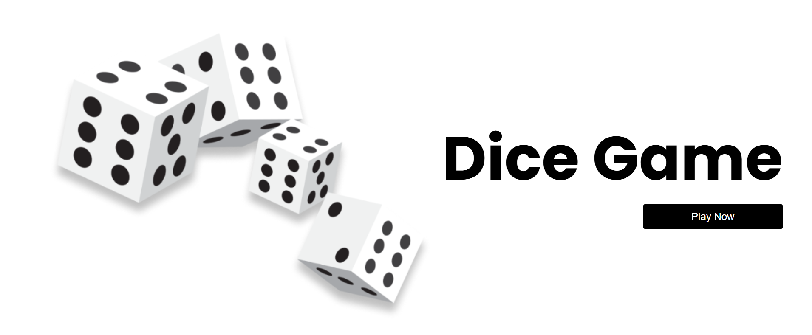
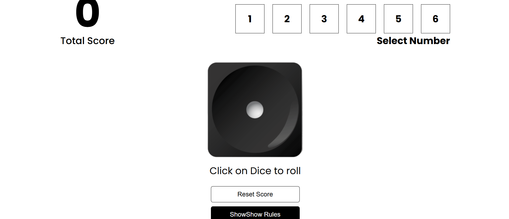

# 🎲 Dice Game

A fun React-based dice game where players guess the dice number. If your guess is right, you earn points equal to the dice value; if you're wrong, you lose 2 points!

---

## 🚀 Features

- Select a number from 1 to 6
- Roll the dice and test your luck!
- Earn points for correct guesses
- Lose 2 points for incorrect guesses
- Reset score anytime
- Easy-to-understand rules toggle

---

## 📸 Game Preview

### 🏠 Home Screen (Start Page)

### 🎮 Dice Game Screen (After Clicking "Play Game")

---

## 🕹️ How to Play

1. Select a number between 1 to 6.
2. Click on the dice image to roll.
3. 🎯 If your selected number matches the dice roll → you gain that number as points.
4. ❌ If not → you lose 2 points.
5. You can reset the score or check rules anytime.

---

## 🔗 Live Demo

[Click here to play!](https://react-dice-game-git-main-tanuja-ranjans-projects.vercel.app)

---
## 🧑‍💻 Tech Stack

- React.js (Vite or CRA)
- CSS

